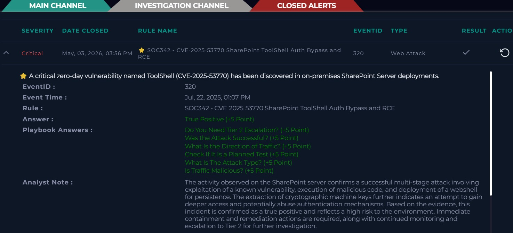

# Incident: SharePoint ToolShell RCE (CVE-2025-53770)

## Alert Overview
- Severity: Critical
- Attack Type: Remote Code Execution
- Detection Rule: SOC342
- Event ID: 320
- Event Time: Jul 22, 2025, 01:07 PM
- Hostname: SharePoint01

## Summary
An unauthenticated POST request was sent to the SharePoint ToolPane endpoint. The request had a large payload and a spoofed referer, matching the known pattern of CVE-2025-53770 exploitation.

## Investigation Process
1. Reviewed the HTTP POST request to /_layouts/15/ToolPane.aspx
2. Checked the payload size and spoofed referer header
3. Found a C# executable compiled on the host using csc.exe
4. Identified a malicious ASPX webshell dropped in a SharePoint directory
5. Detected PowerShell used to extract cryptographic machine keys
6. Checked the webshell hash on VirusTotal — 34/64 engines flagged it

## Key Findings
- Attack matched CVE-2025-53770
- Malicious webshell (spinstall0.aspx) deployed for persistence
- PowerShell used to extract machine keys from server config
- Device action was Allowed — attack reached the target

## Artifacts
- Attacker IP: 107.191.58.76
- Target IP: 172.16.20.17
- Hostname: SharePoint01
- File Hash: 92bb4ddb98eeaf11fc15bb32e71d0a63256a0ed826a03ba293ce3a8bf057a514
- Malicious URL: /_layouts/15/ToolPane.aspx?DisplayMode=Edit&a=/ToolPane.aspx

## MITRE ATT&CK Mapping
- T1190 – Exploit Public-Facing Application
- T1505.003 – Web Shell
- T1059.001 – PowerShell
- T1552.004 – Private Keys

## Impact Assessment
- Attack was successful
- Webshell gives attacker persistent access
- Machine keys extracted — authentication tokens could be forged
- High risk of further compromise

## Decision
True Positive

## Response Actions
- Escalated to Tier 2
- Recommended isolating the affected server
- Recommended removing webshell and payload files
- Recommended resetting credentials
- Recommended patching SharePoint

## Analyst Note
The activity on the SharePoint server confirms a successful 
multi-stage attack. The attacker exploited a known vulnerability, 
ran malicious code, and deployed a webshell for persistence. 
Machine keys were also extracted which could allow authentication 
abuse. This is a confirmed true positive. Immediate containment 
is needed and Tier 2 should investigate further.

## Skills Demonstrated
- SIEM alert triage
- VirusTotal threat validation
- Webshell detection
- MITRE ATT&CK mapping
- Incident response documentation
- Log and artifact analysis

## Evidence Screenshot

