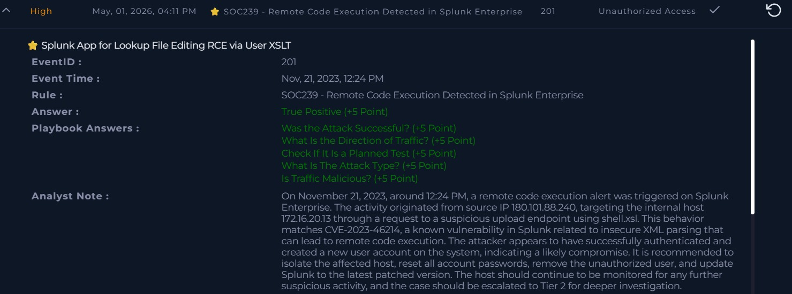

# Incident: Splunk Enterprise RCE via Malicious XSLT Upload (CVE-2023-46214)

## Alert Overview
- Severity: High
- Attack Type: Remote Code Execution
- Detection Rule: SOC239
- Detection Source: SIEM
- Event ID: 201
- Event Time: Nov 21, 2023, 12:24 PM
- Hostname: Splunk Enterprise

## Summary
A suspicious HTTP POST request targeting Splunk Enterprise upload functionality was identified. A malicious XSLT file (shell.xsl) was uploaded matching the exploitation pattern of CVE-2023-46214. The attacker successfully authenticated and created an unauthorized user account on the system.

## Investigation Process
1. Reviewed HTTP POST request to Splunk upload endpoint
2. Identified malicious shell.xsl file upload
3. Correlated activity with CVE-2023-46214 — insecure XML parsing vulnerability
4. Found evidence of successful attacker authentication
5. Confirmed unauthorized user account created on system
6. Verified attack direction — Internet to Company Network

## Key Findings
- Malicious XSLT file shell.xsl uploaded to Splunk
- Activity matched CVE-2023-46214 exploitation pattern
- Attacker successfully authenticated before exploitation
- Unauthorized user account created — confirming compromise
- Device action was Allowed — attack reached the target

## Artifacts
- Attacker IP: 180.101.88.240
- Threat Actor IP: 118.194.247.28
- Target IP: 172.16.20.13
- Hostname: Splunk Enterprise
- Trigger File Path: /opt/splunk/var/run/splunk/dispatch/1700556926.3/shell.xsl
- Malicious URL: http://18.219.80.54:8000/en-US/splunkd/__upload/indexing/preview?output_mode=json&props.NO_BINARY_CHECK=1&input.path=shell.xsl

## MITRE ATT&CK Mapping
- T1190 – Exploit Public-Facing Application
- T1059 – Command and Scripting Interpreter
- T1505 – Server Software Component
- T1136 – Create Account

## Impact Assessment
- Attack was successful
- Unauthorized account created — persistence risk
- Potential lateral movement opportunity
- SIEM platform integrity compromised

## Decision
True Positive

## Response Actions
- Escalated to Tier 2
- Recommended isolating affected host
- Recommended removing unauthorized user account
- Recommended resetting all passwords
- Recommended patching Splunk to latest version
- Advised continued monitoring for suspicious activity

## Analyst Note
On November 21, 2023, a remote code execution alert triggered 
on Splunk Enterprise. The attacker uploaded a malicious XSLT 
file (shell.xsl) to the Splunk upload endpoint, matching 
CVE-2023-46214. The attacker successfully authenticated and 
created a new user account, confirming compromise. The host 
should be isolated, unauthorized account removed, all passwords 
reset, and Splunk updated immediately. Escalated to Tier 2 
for further investigation.

## Skills Demonstrated
- SIEM alert triage
- Log investigation
- CVE analysis and correlation
- Threat intelligence
- Incident response documentation
- Remote code execution analysis

## Evidence Screenshot

