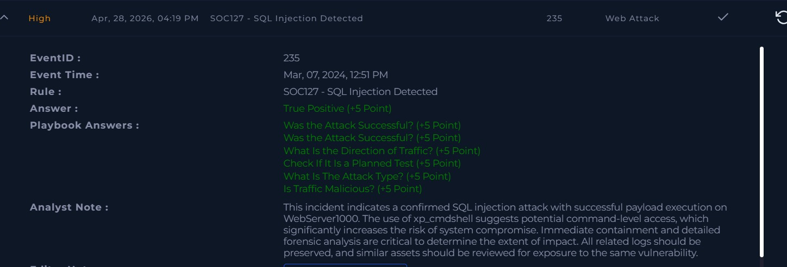

# Incident: SQL Injection Attack with Command Execution Attempt

## Alert Overview
- Severity: High
- Attack Type: Web Attack / SQL Injection
- Detection Rule: SOC127
- Detection Source: SIEM / Web Server Logs
- Event ID: 235
- Event Time: Mar 07, 2024, 12:51 PM
- Target Host: WebServer1000

## Summary
A malicious HTTP GET request targeting an internal web server was detected as a SQL injection attempt. The payload contained UNION-based SQL injection, embedded XSS code, and xp_cmdshell execution attempt. The server returned HTTP 200 confirming the request was processed successfully.

## Investigation Process
1. Reviewed web server logs associated with the alert
2. Analyzed suspicious HTTP GET request payload
3. Identified UNION-based SQL injection patterns
4. Found embedded XSS code within the payload
5. Identified xp_cmdshell execution attempt targeting /etc/passwd
6. Checked HTTP response — server returned 200 confirming processing
7. Correlated findings within SIEM logs

## Key Findings
- UNION-based SQL injection payload confirmed
- XSS code embedded inside the SQL payload
- xp_cmdshell used to attempt reading /etc/passwd
- Server responded HTTP 200 — request was accepted and processed
- Attack originated from external IP targeting internal web server

## Artifacts
- Attacker IP: 118.194.247.28
- Target IP: 172.16.20.12
- Target Host: WebServer1000
- Malicious Request: GET /?douj=3034 AND 1=1 UNION ALL SELECT 1,NULL,'alert("XSS")',table_name FROM information_schema.tables WHERE 2>1; EXEC xp_cmdshell('cat ../../../etc/passwd') HTTP/1.1 200 865

## MITRE ATT&CK Mapping
- T1190 – Exploit Public-Facing Application
- T1059 – Command and Scripting Interpreter
- T1059.004 – Unix Shell
- T1059.007 – JavaScript (XSS embedded in payload)

## Impact Assessment
- Attack was successful — HTTP 200 response confirmed
- Potential unauthorized database access
- xp_cmdshell suggests possible command execution on host
- Risk of sensitive data exposure
- Persistence or lateral movement risk

## Decision
True Positive

## Response Actions
- Escalated to Tier 2
- Recommended immediate isolation of WebServer1000
- Recommended blocking source IP 118.194.247.28
- Preserved logs for forensic investigation
- Recommended WAF rule update for SQLi and XSS
- Recommended disabling xp_cmdshell if not required
- Recommended reviewing similar assets for same vulnerability

## Analyst Note
This incident confirms a SQL injection attack with successful 
payload execution on WebServer1000. The payload included 
xp_cmdshell execution which suggests the attacker attempted 
command-level access on the system. The server responded with 
HTTP 200 confirming the request was processed. Immediate 
containment is needed — isolate the server, block the source 
IP, preserve logs, and disable xp_cmdshell if not required. 
Similar assets should also be reviewed for the same exposure.

## Skills Demonstrated
- SIEM alert triage
- Web log analysis
- SQL injection payload analysis
- XSS detection
- Threat analysis
- Incident response documentation
- Detection of combined attack techniques

## Evidence Screenshot

