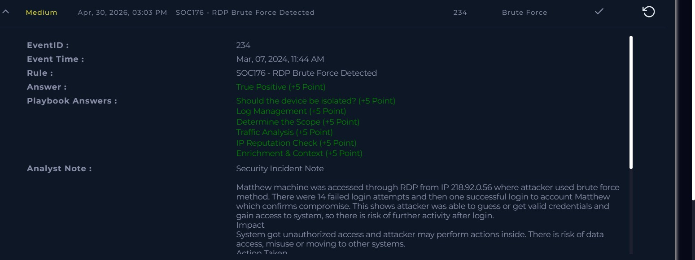

# Incident: RDP Brute Force Leading to Unauthorized Access

## Alert Overview
- Severity: Medium
- Attack Type: Brute Force / Unauthorized Access
- Detection Rule: SOC176
- Detection Source: SIEM / Authentication Logs
- Event ID: 234
- Event Time: Mar 07, 2024, 11:44 AM
- Target Host: Matthew

## Summary
A suspicious series of RDP authentication attempts from an external IP was detected. Investigation found 14 failed login attempts followed by one successful login to account Matthew, confirming compromise through brute force activity.

## Investigation Process
1. Reviewed authentication and RDP login logs
2. Identified 14 repeated login failures from single source IP
3. Correlated timestamps to analyze attack pattern
4. Verified successful login following failed attempts
5. Reviewed firewall activity — connection was allowed
6. Performed IP reputation and contextual analysis

## Key Findings
- 14 failed login attempts from single external IP
- Successful login observed after repeated failures
- Attack originated externally targeting internal host
- Firewall action was Allowed — connection reached target
- Confirms credential compromise and unauthorized access

## Artifacts
- Attacker IP: 218.92.0.56
- Target IP: 172.16.17.148
- Target Host: Matthew
- Protocol: RDP
- Firewall Action: Allowed

## MITRE ATT&CK Mapping
- T1110 – Brute Force
- T1078 – Valid Accounts
- T1021.001 – Remote Desktop Protocol

## Impact Assessment
- Unauthorized access to internal system confirmed
- Risk of data access or misuse
- Potential lateral movement across environment
- Attacker persistence risk

## Decision
True Positive

## Response Actions
- Escalated incident for deeper investigation
- Recommended immediate host isolation
- Recommended blocking source IP 218.92.0.56
- Recommended password reset for affected account Matthew
- Recommended enabling account lockout policy
- Recommended restricting RDP to trusted sources only
- Recommended enabling MFA

## Analyst Note
Matthew machine was accessed through RDP from IP 218.92.0.56 
using brute force. There were 14 failed login attempts followed 
by one successful login to account Matthew, confirming 
compromise. The attacker guessed or obtained valid credentials 
and gained access to the system. There is risk of further 
activity, data access, or lateral movement. Immediate 
containment steps were taken. Recommendations include strong 
passwords, account lockout policy, restricting RDP to trusted 
sources only, and enabling MFA.

## Skills Demonstrated
- Authentication log analysis
- SIEM investigation
- Threat intelligence and IP enrichment
- Incident triage
- Brute force attack detection
- Incident response documentation

## Evidence Screenshot

