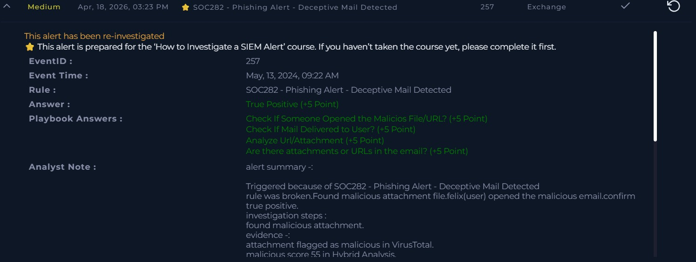

# Incident: Phishing Email with Malicious Attachment

## Alert Overview
- Severity: Medium
- Attack Type: Phishing / Malicious Attachment
- Detection Rule: SOC282
- Detection Source: SIEM / Exchange Email Logs
- Event ID: 257
- Event Time: May 13, 2024, 09:22 AM
- Target User: felix

## Summary
A phishing alert triggered after a suspicious email with a malicious attachment was delivered to user felix. Investigation confirmed the user opened the email and attachment. Threat intelligence tools confirmed the attachment as malicious.

## Investigation Process
1. Reviewed email alert details and metadata
2. Verified email was delivered to target user felix
3. Confirmed user opened the malicious attachment
4. Analyzed attachment on VirusTotal and Hybrid Analysis
5. Correlated findings with SIEM alert information
6. Assessed indicators for malicious behavior

## Key Findings
- Email successfully delivered to user felix
- User opened the malicious attachment
- VirusTotal flagged attachment as malicious
- Hybrid Analysis malicious score — 55
- Phishing activity confirmed through multiple sources

## Artifacts
- Target User: felix
- Sender Email: free@coffeeshooop.com
- Source IP: 172.16.20.3
- VirusTotal: Malicious detection confirmed
- Hybrid Analysis Score: 55

## MITRE ATT&CK Mapping
- T1566 – Phishing
- T1566.001 – Spearphishing Attachment
- T1204 – User Execution
- T1204.002 – Malicious File

## Impact Assessment
- Malicious attachment opened by user
- Risk of malware execution on endpoint
- Potential credential theft
- Possible unauthorized access to user system

## Decision
True Positive

## Response Actions
- Blocked sender email free@coffeeshooop.com
- Blocked source IP 172.16.20.3
- Contained affected host felix
- Recommended endpoint monitoring for suspicious activity
- Escalated for further investigation

## Analyst Note
Alert triggered by SOC282 - Phishing Alert rule. Found malicious 
attachment in email delivered to user felix. Felix opened the 
email and attachment confirming user interaction. Attachment 
flagged as malicious on VirusTotal and scored 55 on Hybrid 
Analysis confirming threat. Classified as true positive. 
Actions taken — blocked sender email free@coffeeshooop.com, 
blocked IP 172.16.20.3, and contained host felix.

## Skills Demonstrated
- Email security analysis
- Threat intelligence investigation
- VirusTotal and Hybrid Analysis usage
- SIEM alert triage
- Incident response documentation
- Phishing detection and containment

## Evidence Screenshot

